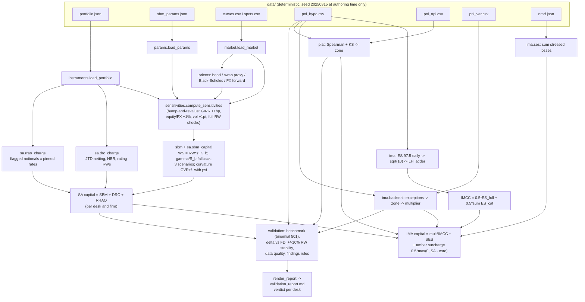
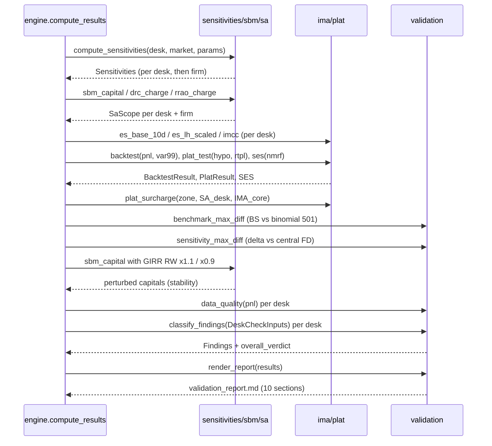
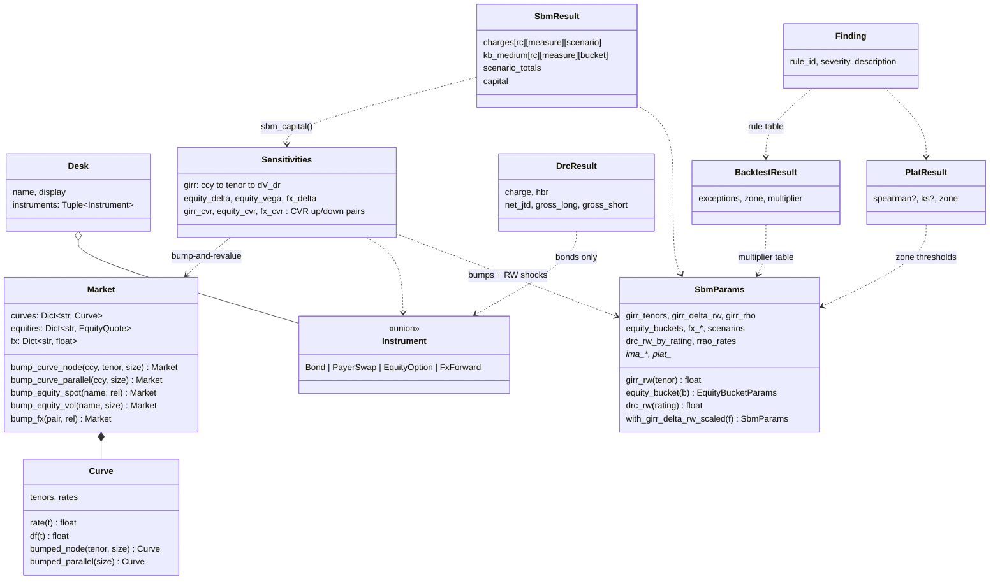

# ARCHITECTURE — P15 `frtb`

Design notes for the FRTB & model-validation kit. The Python package
(`python/src/frtb`) is the reference; the C++ (`frtb::`), Rust (crate
`frtb`) and Java (`com.quant.frtb`) ports mirror it module-for-module against
the numerical contract in [API_SPEC.md](../API_SPEC.md) and the golden values
in `data/golden/golden.json`.

> Educational parameter set (Basel-2019-flavored, pinned). Not a compliant
> capital engine.

## 1. Component responsibilities

| module | responsibility | key exports |
|---|---|---|
| `params` | Load and validate the pinned parameter file; all lookups fail loudly on missing keys; immutable copy-with-scaled-RW for the stability check | `SbmParams`, `load_params`, `with_girr_delta_rw_scaled` |
| `market` | Immutable market snapshots: zero curves (linear in tenor, flat extrapolation, `DF = exp(−z·t)`), equity quotes, FX spots; every bump returns a *new* Market | `Market`, `Curve`, `load_market`, `bump_*` |
| `instruments` | Instrument dataclasses with constructor validation; portfolio loading | `Bond`, `PayerSwap`, `EquityOption`, `FxForward`, `Desk`, `load_portfolio` |
| `pricers` | Deterministic pricer kit: bullet bond, payer-swap proxy, Black–Scholes with dividend yield (T=0 / σ=0 edge cases), FX forward, CRR binomial benchmark | `bs_price/delta/vega`, `binomial_price`, `price_instrument`, `price_portfolio` |
| `sensitivities` | Pinned bump-and-revalue over a scope; drops \|s\| ≤ 1e-9; computes CVR± with the delta term stripped | `Sensitivities`, `compute_sensitivities` |
| `sbm` | Pure aggregation math: K_b, across-bucket with S_b fallback, scenario scaling, curvature with ψ | `bucket_kb`, `aggregate_buckets`, `delta_vega_charge`, `curvature_charge`, `scale_rho`, `psi` |
| `sa` | Assembles SBM (3 classes × 3 measures × 3 scenarios), DRC-lite (JTD, netting, HBR), RRAO | `sbm_capital`, `drc_charge`, `rrao_charge`, `SbmResult`, `DrcResult` |
| `ima` | ES 97.5 (daily → √10 → LH ladder), IMCC, backtesting zones/multipliers, SES, IMA capital | `es_base_10d`, `es_lh_scaled`, `imcc`, `backtest`, `ses`, `ima_capital` |
| `stats` | Native Spearman (average ranks) and exact two-sample KS — no scipy at runtime | `spearman`, `ks_statistic`, `average_ranks`, `pearson` |
| `plat` | PLAT zones from pinned thresholds, constant-series → Red convention, amber surcharge | `plat_test`, `plat_zone_from_metrics`, `plat_surcharge` |
| `validation` | Independent checks (benchmark, FD delta, stability, data quality), pinned findings rule table, verdicts, markdown report generator | `benchmark_max_diff`, `classify_findings`, `overall_verdict`, `render_report` |
| `engine` | Orchestration: load everything, SA per desk + firm, IMA per desk, validation, report | `compute_results`, `compute_sa`, `load_pnl_csv` |

The dependency direction is strictly downward: `engine` → (`sa`, `ima`,
`plat`, `validation`) → (`sbm`, `sensitivities`, `stats`) → (`pricers`,
`instruments`, `market`, `params`). `sbm` and `stats` are pure math with no
I/O and no knowledge of instruments — they take plain numbers and callbacks,
which is what makes the hand-computable golden cases and the constructed
fallback tests possible.

## 2. Data flow

Three properties of this flow are load-bearing:

* **Scopes are instrument lists, not desks.** `compute_sa` takes any
  `Sequence[Instrument]` — a desk, the firm, or an empty list (capital 0).
  Firm capital is *not* the sum of desk capitals: aggregation is non-linear
  (the firm's USD GIRR bucket nets desk 1's steepener against desk 2's
  discounting exposure, and DRC nets across desks).
* **The whole portfolio is repriced under every bump.** Sensitivities belong
  to the scope, not the instrument — desk 2's options contribute GIRR delta
  through discounting, and the EUR curve appears via the FX forward's foreign
  discount factor.
* **The PLAT surcharge couples SA into IMA.** IMA capital cannot be computed
  before SA — mirrored in `engine.compute_results` ordering.

## 3. Orchestration sequence

## 4. Key types

All result types are immutable value objects (`@dataclass(frozen=True)` /
C++ structs / Rust structs / Java records or final-field classes) so the
engine can hand them to the report generator and tests without defensive
copies.

## 5. Numerical design decisions and trade-offs

* **Bump-and-revalue with immutable snapshots.** Every `bump_*` returns a
  fresh `Market`; the base value `V` is priced once per scope. Cost: O(bumps)
  full-portfolio revaluations (≈ 30 per scope: 2×10 curve nodes + equity/FX/
  vol bumps + curvature shocks). With ≤ 9 instruments and closed-form pricers
  this is microseconds; correctness (no state leakage, order independence)
  wins over speed by design. An analytic-Greek shortcut was rejected because
  bump-and-revalue exercises exactly the code path a real SBM feed would.
* **`max(0, ·)` inside every aggregation sqrt.** Scenario-scaled correlation
  matrices are not guaranteed PSD; the guard converts "slightly negative by
  construction or rounding" into 0 instead of NaN. The S_b fallback is taken
  *once* (per the FRTB text), with the guard kept as belt and braces.
* **The ε-guard in the ES tail count**: `k = max(1, ceil((1−α)n − 1e-9))`.
  `(1−0.975)·260 = 6.5` is fine, but e.g. `(1 − 0.975)·40` evaluates to
  `1.0000000000000009` in binary — a naive `ceil` gives 2 on every platform
  and downstream golden values silently shift. This is the single most likely
  cross-language divergence point; the ε pins it.
* **Correlation values are tabulated, not formulas.** The GIRR ρ matrix is
  generated once (`max(exp(−0.03·Δ/min T), 0.40)`, rounded to 6 dp) and
  stored in `sbm_params.json`. Ports read the table rather than re-deriving
  it, so `exp` implementation differences cannot create sub-tolerance drift.
* **Native statistics.** Spearman (average-rank ties) and the exact pooled
  two-sample KS are implemented from first principles in ~80 lines; scipy is
  used only in the Python tests as a cross-check. This keeps runtime
  dependencies at numpy-only in Python and zero beyond serde in Rust, and
  guarantees the same tie handling in all four languages.
* **Near-zero sensitivity culling** (|s| ≤ 1e-9) keeps all-zero currencies
  out of GIRR bucket sets, so bucket membership — not just values — is
  identical across languages (sign noise at 1e-13 would otherwise create
  phantom EUR buckets from rounding).
* **Binomial benchmark, 501 steps, vectorised.** The CRR lattice exists only
  for validation; 501 is odd (a node straddles the strike less often, halving
  oscillation) and pinned so the benchmark diff is itself a golden value.
* **Determinism as an invariant.** No RNG at runtime anywhere; the data
  generator's seeded RNG (seed 20250815) plus deterministic tuning searches
  produced the bundled CSVs once. `test_determinism.py` recomputes the full
  result tree twice and compares.

## 6. Error-handling strategy

Fail loudly and early, with the offending value in the message. Uniform
mapping across languages:

| condition (examples) | Python | C++ | Rust | Java |
|---|---|---|---|---|
| bad pricer input (S ≤ 0, σ < 0, T < 0), non-increasing tenors, bumping a non-node tenor | `ValueError` | `std::invalid_argument` / `std::domain_error` | `Err(FrtbError)` | `IllegalArgumentException` |
| missing params key / bucket / rating / RRAO category / tenor RW | `ValueError` | `std::invalid_argument` | `Err(FrtbError)` | `IllegalArgumentException` |
| series length mismatch, constant series in Pearson, category P&L ≠ desk P&L, negative VaR / stressed loss | `ValueError` | `std::invalid_argument` | `Err(FrtbError)` | `IllegalArgumentException` |

Policy points:

* **Validation at construction** — instruments and curves check their own
  invariants in `__post_init__`/constructors, so no pricer needs to re-check.
* **No silent defaults for regulatory parameters.** A missing bucket or
  rating is a hard error (spec edge case), never a fallback weight — a real
  capital engine that guessed a risk weight would be a validation finding of
  the highest severity.
* **One deliberate soft path**: a constant P&L series in PLAT is *caught*
  (the `spearman` `ValueError`) and mapped to the documented Red-zone result
  with null metrics — an expected business outcome, not a crash.
* Rust returns `Result<_, FrtbError>` (a thiserror-style manual enum) from
  every fallible function; no panics on bad input.

## 7. Testing strategy

* **Golden values (cross-language).** 21 cases in `data/golden/golden.json`
  cover every subsystem: GIRR WS ladder, K_b values, the three scenario
  totals + capital, desk capitals, equity curvature, DRC/HBR, RRAO, ES
  base/LH, IMCC, PLAT metrics + zones, backtest counts + multipliers, SES,
  benchmark diff, stability delta, verdict strings. Tolerances 1e-8 to
  1e-12; strings exact. The first case (`sbm_agg_hand_2bucket`) is
  hand-derivable (√75, √159) and validated analytically by the generator
  before anything else is written — if the formula is wrong, no golden file
  exists to be wrong against.
* **Hand-computable unit cases**: 2-bucket aggregation at 1e-12; scenario
  scaling capped at 1.0 under high; an S_b fallback case *constructed* to
  drive the quadratic form negative; DRC netting/HBR on a 3-position hand
  case; LH ladder monotonicity and the single-category collapse
  `ES·√(LH/10)`; multiplier table edges (4/5/9/10 exceptions); PLAT zone
  thresholds exactly at 0.85/0.80/0.09/0.12.
* **Property-style loops**: put–call parity across the benchmark grid; BS
  delta vs finite differences over a grid; binomial → BS convergence;
  ladder monotonicity over category subsets.
* **Edge cases from the spec**: empty desk (zero capital), all-long DRC
  (HBR = 1), zero sensitivities dropped, missing bucket param → error,
  constant P&L → PLAT Red, > 12 exceptions → red cap, negative-gamma
  curvature, T=0 / σ=0 options.
* **Report tests**: string-contains checks that all ten `## ` sections are
  always emitted, plus findings rules fired on constructed failures.
* **Determinism**: full pipeline run twice, results compared field by field;
  no RNG import anywhere in `src/`.

The Python suite is 111 tests in ~1s; each port runs the same golden file
plus its own unit/property suites (25+ assertions per language minimum).

## 8. Performance notes

* The workload is dominated by bump-and-revalue: ~30 revaluations per scope
  × 3 scopes, each revaluation ≤ 9 closed-form prices. The whole
  `compute_results` — SA for three scopes, IMA for two desks, the 40-point
  binomial benchmark and the report — runs in well under a second in every
  language.
* The 501-step binomial (validation only) is the only O(n²)-ish kernel; the
  Python version rolls the lattice with numpy vector ops, the ports use a
  simple backward-induction array. 40 grid prices × 501 steps ≈ 5M node
  updates — milliseconds.
* SBM aggregation is O(K²) per bucket in the number of factors (≤ 10 tenors)
  — negligible. The design consciously prefers the readable double loop
  matching the formula over matrix machinery.
* ES/LH is O(n log n) sorts on 260-point series; PLAT's KS is a linear sweep
  after sorting.
* Memory: everything is value-copied snapshots; peak usage is a few
  megabytes. Copying a `Market` per bump (dict copy of ≤ 4 entries) was
  chosen over in-place bump/unbump precisely because the cost is trivial at
  this scale and the aliasing bugs it prevents are not.
* Scaling caveat (documented, not engineered for): a real book with 10⁵
  positions and 10³ risk factors would need sensitivity caching, sparse
  bucket maps and revaluation batching; the O(factors × instruments)
  full-reprice here is the teaching-clarity choice.
